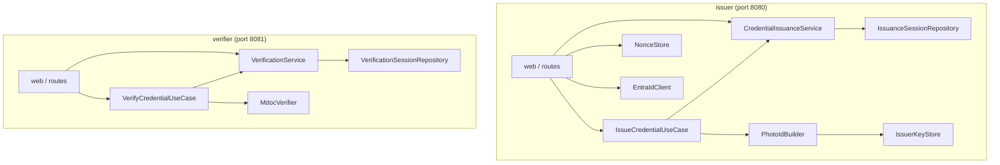
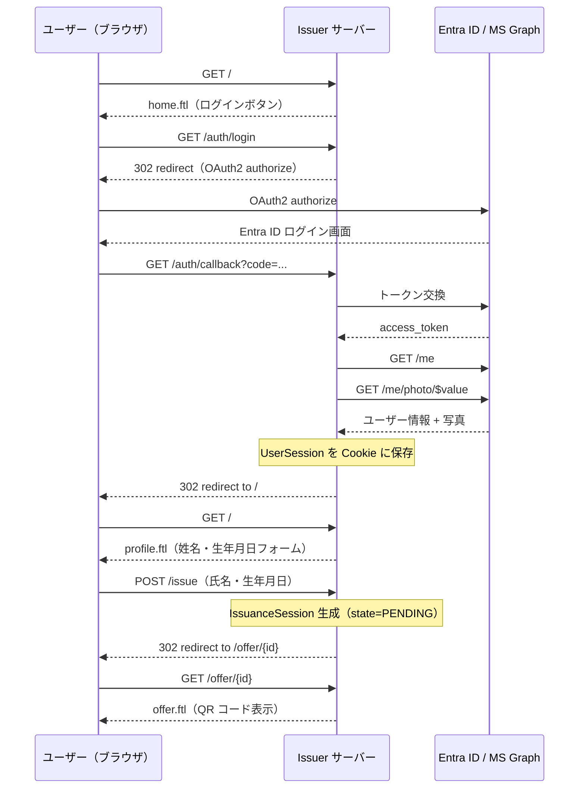
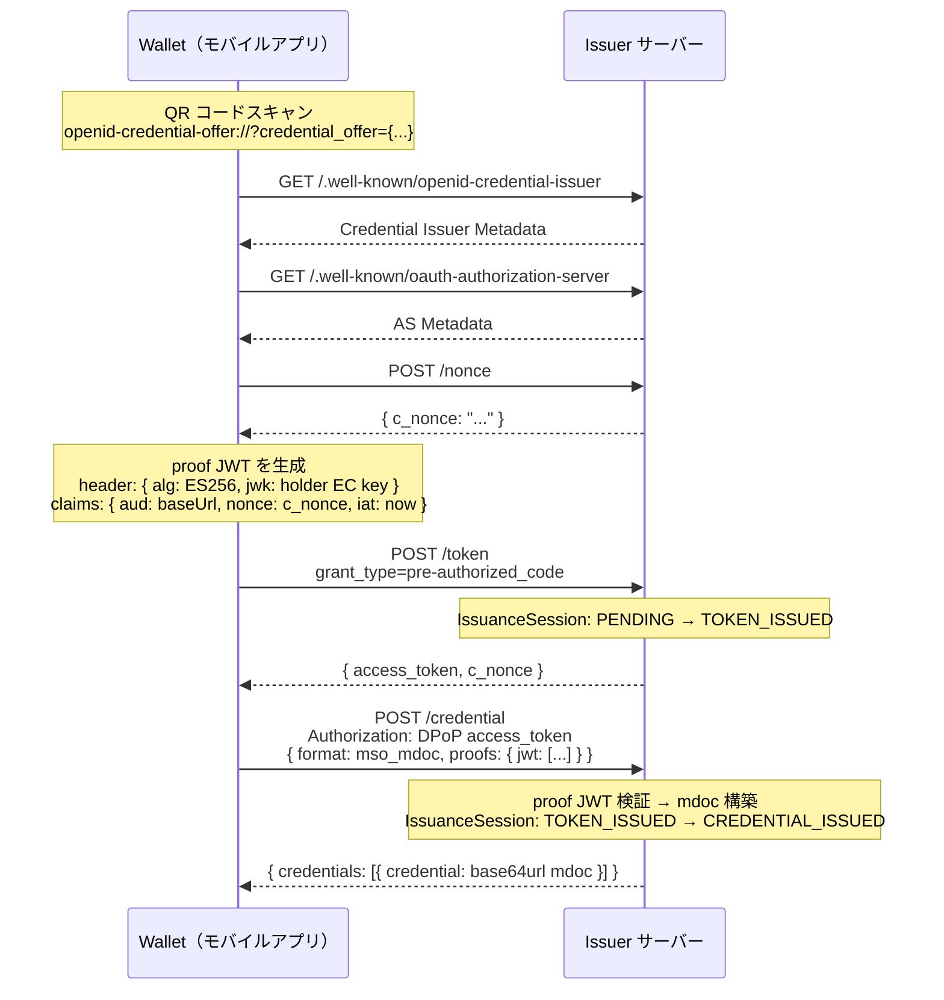
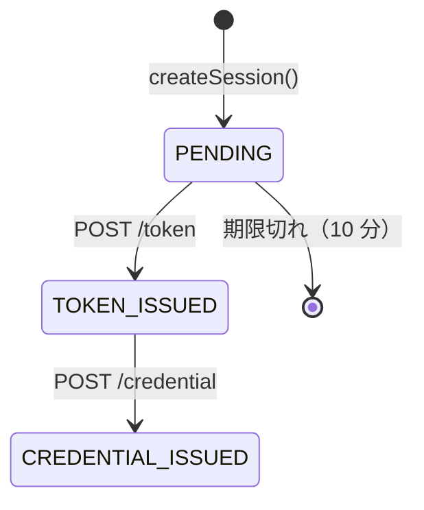
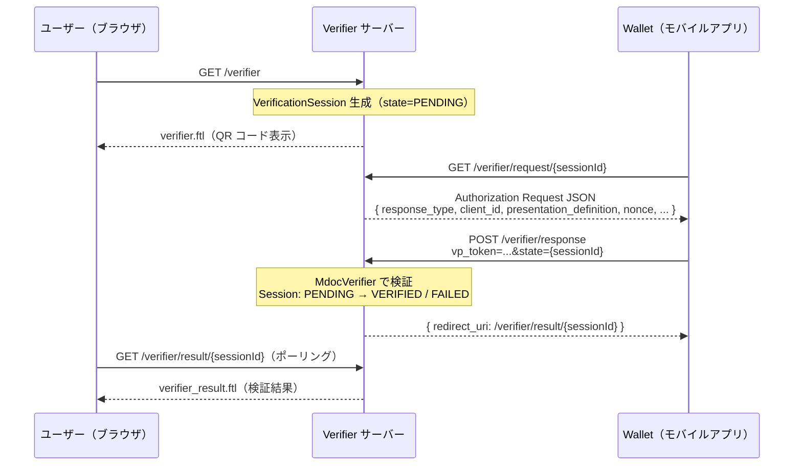
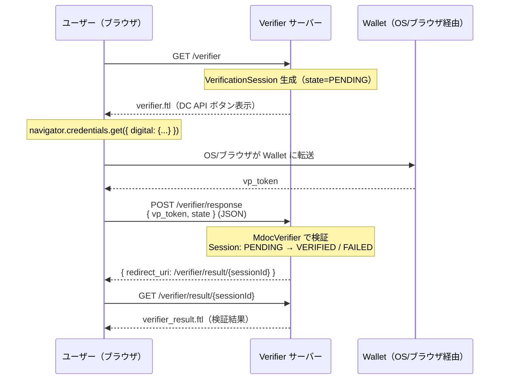
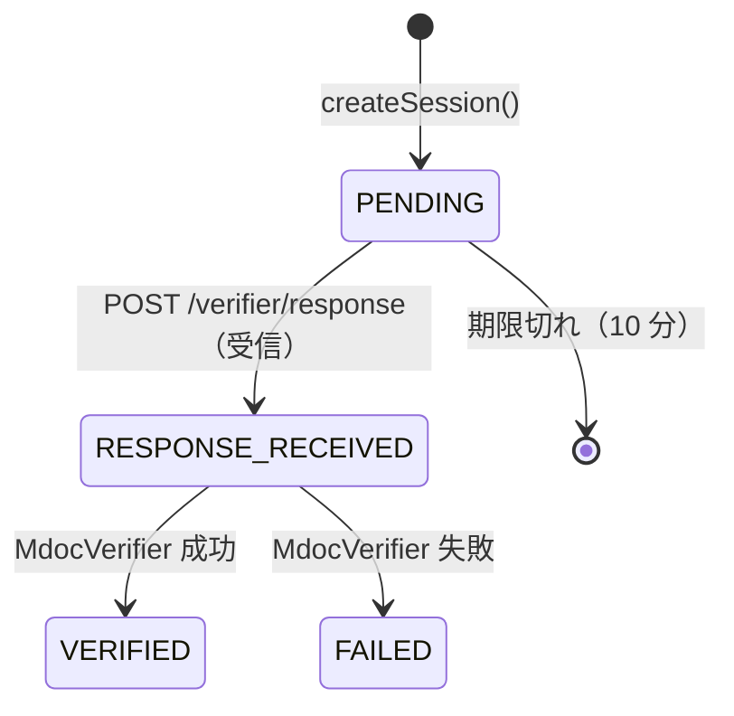

# vdc-apps

Microsoft Entra ID と連携した **ISO/IEC TS 23220-4 Photo ID** の発行・検証を行う Kotlin/JVM マルチモジュールプロジェクト。

| モジュール | 役割                                                        | デフォルトポート |
| ---------- | ----------------------------------------------------------- | ---------------- |
| `issuer`   | OID4VCI Pre-Authorized Code フローで Photo ID（mdoc）を発行 | 8080             |
| `verifier` | OID4VP / Digital Credentials API で Photo ID を検証         | 8081             |

---

## 目次

- [技術スタック](#技術スタック)
- [アーキテクチャ](#アーキテクチャ)
- [Issuer](#issuer)
- [Verifier](#verifier)
- [セットアップ](#セットアップ)
- [ビルド・実行](#ビルド実行)
- [設計上の判断と制約](#設計上の判断と制約)

---

## 技術スタック

| カテゴリ | ライブラリ / バージョン |
| --- | --- |
| 言語 | Kotlin 2.2.0 / JVM 21 |
| Web フレームワーク | Ktor 3.0.3 + Netty |
| CSS フレームワーク | Tailwind |
| mdoc 構築・検証 | Multipaz 0.97.0 (GMaven `google()`) |
| 認証（Issuer） | Ktor OAuth プラグイン + Entra ID |
| JWT 検証（Issuer） | Nimbus JOSE+JWT 9.47 |
| 証明書生成（Issuer） | Bouncy Castle 1.78.1 |
| QR コード生成 | ZXing 3.5.3 |
| テンプレートエンジン | FreeMarker（Ktor 同梱） |
| シリアライゼーション | kotlinx.serialization 1.7.3 |
| Redis クライアント | Jedis 5.2.0 |
| ログ | Logback 1.5.12 + logstash-logback-encoder 8.0（JSON 出力） |

---

## アーキテクチャ

DDD 軽量版のレイヤード・アーキテクチャを採用。各モジュールが独立したアプリケーションとして動作する。

### プロジェクト構造

```text
vdc-apps/
├── issuer/                                # Issuer アプリケーション
│   └── src/main/kotlin/org/vdcapps/issuer/
│       ├── Application.kt
│       ├── application/IssueCredentialUseCase.kt
│       ├── domain/
│       │   ├── credential/                # Photo ID 発行ドメイン
│       │   └── identity/EntraUser.kt
│       ├── infrastructure/
│       │   ├── entra/EntraIdClient.kt
│       │   ├── multipaz/{IssuerKeyStore, PhotoIdBuilder}.kt
│       │   └── redis/RedisIssuanceSessionRepository.kt
│       └── web/
│           ├── plugins/{Auth, Routing, Serialization}.kt
│           └── routes/{Auth, Health, Home, Oid4vci}Routes.kt
└── verifier/                              # Verifier アプリケーション
    └── src/main/kotlin/org/vdcapps/verifier/
        ├── Application.kt
        ├── application/VerifyCredentialUseCase.kt
        ├── domain/verification/           # 検証ドメイン
        ├── infrastructure/
        │   ├── multipaz/MdocVerifier.kt
        │   └── redis/RedisVerificationSessionRepository.kt
        └── web/
            ├── plugins/{Routing, Serialization}.kt
            └── routes/{Health, Verifier}Routes.kt
```

### 依存関係図



---

## Issuer

### 発行する証明書

| 項目         | 値                                 |
| ------------ | ---------------------------------- |
| 標準         | ISO/IEC TS 23220-4                 |
| Doctype      | `org.iso.23220.photoid.1`          |
| フォーマット | `mso_mdoc` (CBOR/COSE)             |
| プロトコル   | OID4VCI Pre-Authorized Code フロー |

### 発行される属性

`org.iso.23220.2` 名前空間:

| 属性名                      | 内容           | 取得元                                                 |
| --------------------------- | -------------- | ------------------------------------------------------ |
| `family_name`               | 姓             | ユーザー入力（Entra ID の値を初期値）                  |
| `given_name`                | 名             | ユーザー入力（Entra ID の値を初期値）                  |
| `birth_date`                | 生年月日       | ユーザー入力（必須）                                   |
| `issue_date`                | 発行日         | サーバー現在日時                                       |
| `expiry_date`               | 有効期限       | 発行日 + `credentialValidityDays`（デフォルト 365 日） |
| `issuing_country`           | 発行国コード   | 環境変数 `ISSUING_COUNTRY`（デフォルト `JP`）          |
| `issuing_authority_unicode` | 発行機関名     | 環境変数 `ISSUING_AUTHORITY`                           |
| `portrait`                  | 顔写真（JPEG） | MS Graph API `/me/photo/$value`（未設定時は省略）      |

`org.iso.23220.photoid.1` 名前空間:

| 属性名            | 内容                                 |
| ----------------- | ------------------------------------ |
| `document_number` | 発行時に自動生成される 12 桁の英数字 |
| `person_id`       | `document_number` と同値             |

### Issuer の処理フロー

#### ブラウザ UI フロー



#### OID4VCI Pre-Authorized Code フロー



#### IssuanceSession 状態遷移



### Issuer API エンドポイント

| メソッド | パス | 説明 |
| --- | --- | --- |
| `GET` | `/health` | Liveness probe（常に 200 OK） |
| `GET` | `/readiness` | Readiness probe（Redis 疎通確認。503 = 未準備） |
| `GET` | `/` | ホーム または プロフィールフォーム |
| `GET` | `/profile` | プロフィール確認フォーム |
| `POST` | `/issue` | 証明書発行開始 |
| `GET` | `/offer/{sessionId}` | QR コード表示ページ |
| `GET` | `/auth/login` | Entra ID OAuth フロー開始 |
| `GET` | `/auth/callback` | OAuth コールバック |
| `GET` | `/auth/logout` | セッション削除 |
| `GET` | `/.well-known/openid-credential-issuer` | Credential Issuer Metadata（OID4VCI §10.2） |
| `GET` | `/.well-known/oauth-authorization-server` | AS Metadata（RFC 8414） |
| `GET` | `/jwks` | JWK Set（発行者署名検証鍵） |
| `POST` | `/nonce` | c_nonce 取得 |
| `POST` | `/token` | pre-authorized_code → access_token 交換 |
| `POST` | `/credential` | proof JWT 検証 → 署名済み mdoc 発行 |

### mdoc 構築の詳細

`PhotoIdBuilder.buildCredential()` が以下の順序で mdoc を構築する。

1. `buildIssuerNamespaces { ... }` — 各 data element に 256 bit のランダム salt を付与
2. `issuerNamespaces.getValueDigests(Algorithm.SHA256)` — SHA-256 ダイジェストマップを生成
3. `MobileSecurityObject(...)` — deviceKey に Wallet の EC P-256 公開鍵を設定
4. `Tagged(24, Bstr(Cbor.encode(mso)))` — MSO を CBOR エンコードして Tag 24 でラップ
5. `Cose.coseSign1Sign(...)` — ES256 で署名、x5chain に発行者証明書を設定（IssuerAuth）
6. `buildCborMap { "nameSpaces", "issuerAuth" }` — IssuerSigned 構造を組み立て
7. `Cbor.encode(...).toBase64Url()` — base64url（パディングなし）でエンコード

---

## Verifier

### 対応する検証フロー

| フロー                  | 説明                                                                              |
| ----------------------- | --------------------------------------------------------------------------------- |
| OID4VP（QR コード）     | `openid4vp://?request_uri=...` を QR 表示、Wallet が応答                          |
| Digital Credentials API | ブラウザの `navigator.credentials.get({ digital: {...} })` で Wallet から直接受信 |

### 検証内容

`MdocVerifier` が DeviceResponse CBOR を受け取り以下を検証する。

1. **COSE_Sign1 署名検証** — x5chain の X.509 証明書で ES256 署名を検証
2. **MSO の docType 一致確認** — Document の docType と MSO の docType が一致しているか
3. **有効期限確認** — `validFrom ≤ now ≤ validUntil`
4. **クレーム抽出** — IssuerSignedItem をデコードして名前空間 → 要素名 → 値のマップに変換

### Verifier の処理フロー

#### OID4VP QR コードフロー



#### Digital Credentials API フロー



#### VerificationSession 状態遷移



### Verifier API エンドポイント

| メソッド | パス | 説明 |
| --- | --- | --- |
| `GET` | `/health` | Liveness probe（常に 200 OK） |
| `GET` | `/readiness` | Readiness probe（Redis 疎通確認。503 = 未準備） |
| `GET` | `/verifier` | 検証開始ページ（QR コード + DC API ボタン） |
| `GET` | `/verifier/request/{sessionId}` | OID4VP Authorization Request JSON |
| `POST` | `/verifier/response` | vp_token 受信・検証（form-urlencoded / JSON 両対応） |
| `GET` | `/verifier/result/{sessionId}` | 検証結果ページ（JSON ポーリング対応） |

---

## セットアップ

### Azure アプリ登録（Issuer のみ必要）

1. [Azure Portal](https://portal.azure.com) でアプリを登録する
2. **リダイレクト URI** を `{BASE_URL}/auth/callback` に設定（種別: Web）
3. **API アクセス許可** に `User.Read`（MS Graph）を追加
4. **クライアントシークレット** を生成してメモする

### 環境変数

#### Issuer の設定

```env
# 必須
ENTRA_TENANT_ID=<Azure AD テナント ID>
ENTRA_CLIENT_ID=<アプリ登録のクライアント ID>
ENTRA_CLIENT_SECRET=<クライアントシークレット>

# 任意（デフォルト値あり）
BASE_URL=https://your-issuer.example.com     # デフォルト: http://localhost:8080
ENTRA_REDIRECT_URI=https://your-issuer.example.com/auth/callback
KEY_STORE_PATH=issuer-keystore.p12            # デフォルト: issuer-keystore.p12
KEY_STORE_PASSWORD=<強いパスワードを設定>    # 必須。デフォルト値なし（セキュリティ上）
ISSUING_COUNTRY=JP
ISSUING_AUTHORITY=VDC Apps Issuer
REDIS_URL=redis://localhost:6379              # 未設定時はインメモリ
LOG_FORMAT=json                               # json（デフォルト）または text（ローカル開発向け）
LOG_LEVEL_APP=INFO                            # アプリログレベル（DEBUG/INFO/WARN/ERROR）
LOG_LEVEL_KTOR=WARN                           # Ktor フレームワークログレベル
```

#### Verifier の設定

```env
# 任意（デフォルト値あり）
BASE_URL=https://your-verifier.example.com   # デフォルト: http://localhost:8081
PORT=8081
REDIS_URL=redis://localhost:6379              # 未設定時はインメモリ
TRUSTED_ISSUER_CERT=/path/to/issuer-ca.pem   # 信頼する発行者証明書の PEM ファイル
                                              # 未設定時は警告を出力して検証をスキップ（開発専用）
LOG_FORMAT=json                               # json（デフォルト）または text（ローカル開発向け）
LOG_LEVEL_APP=INFO                            # アプリログレベル（DEBUG/INFO/WARN/ERROR）
LOG_LEVEL_KTOR=WARN                           # Ktor フレームワークログレベル
```

---

## ビルド・実行

```bash
# 全モジュールビルド
./gradlew build

# --- Issuer ---
# ビルド
./gradlew :issuer:build

# テスト
./gradlew :issuer:test
./gradlew :issuer:test --tests "org.vdcapps.issuer.domain.credential.CredentialIssuanceServiceTest"

# 起動（環境変数を事前に設定）
./gradlew :issuer:run

# 実行可能ディストリビューションを生成して起動
./gradlew :issuer:installDist
./issuer/build/install/issuer/bin/issuer

# --- Verifier ---
# ビルド
./gradlew :verifier:build

# 起動
./gradlew :verifier:run

# 実行可能ディストリビューションを生成して起動
./gradlew :verifier:installDist
./verifier/build/install/verifier/bin/verifier
```

### cloudflared でローカル開発（HTTPS が必要な場合）

ウォレットアプリが Issuer と通信できるように HTTPS で公開するために、cloudflared を使う。

```bash
# Issuer を HTTPS で公開
cloudflared tunnel --url http://localhost:8080
# → BASE_URL と ENTRA_REDIRECT_URI をその URL に設定

# Verifier を HTTPS で公開
cloudflared tunnel --url http://localhost:8081
# → BASE_URL をその URL に設定
```

### fly.io デプロイ手順

```shell
# 初回（アプリ名は fly.toml に合わせて変更）
fly apps create vdc-apps-issuer
fly apps create vdc-apps-verifier

# Secrets 設定（issuer）
fly secrets set -c fly.issuer.toml \
  ENTRA_TENANT_ID=xxx \
  ENTRA_CLIENT_ID=xxx \
  ENTRA_CLIENT_SECRET=xxx

# デプロイ（リポジトリ root から実行）
fly deploy -c fly.issuer.toml
fly deploy -c fly.verifier.toml

# デプロイ後に BASE_URL を設定
fly secrets set -c fly.issuer.toml \
  BASE_URL=https://vdc-apps-issuer.fly.dev \
  ENTRA_REDIRECT_URI=https://vdc-apps-issuer.fly.dev/auth/callback
fly secrets set -c fly.verifier.toml \
  BASE_URL=https://vdc-apps-verifier.fly.dev
```

キーストアの永続化のため `fly.issuer.toml` には Volume マウント (`/app/data`) を設定済みです。初回デプロイ前に `fly volumes create issuer_data --region nrt -c fly.issuer.toml` が必要です。

### AWS Elastic Beanstalk デプロイ手順

プラットフォーム: `64bit Amazon Linux 2023 v4.x.x running Corretto 21`

```shell
# ZIP 作成
./scripts/eb-package.sh issuer
./scripts/eb-package.sh verifier

# EB 環境へ機密情報を設定（issuer）
eb setenv ENTRA_TENANT_ID=xxx ENTRA_CLIENT_ID=xxx ENTRA_CLIENT_SECRET=xxx \
          BASE_URL=https://xxx.elasticbeanstalk.com \
          ENTRA_REDIRECT_URI=https://xxx.elasticbeanstalk.com/auth/callback

# デプロイ
eb deploy   # または AWS コンソールから ZIP をアップロード
```

EB の BASE_URL は EB 環境作成後に判明するため、デプロイ → URL 確認 → eb setenv → 再デプロイ の順になります。

---

## 設計上の判断と制約

### モジュール分離

Issuer と Verifier は DDD 的に別ドメインであるため、独立したアプリケーションとして分離している。共有コードはなく、パッケージ名も `org.vdcapps.issuer` と `org.vdcapps.verifier` で独立している。

### 生年月日の入力

Entra ID の標準属性には生年月日が含まれないため、ブラウザ UI でユーザーに直接入力させる。

### 顔写真の省略

MS Graph API `/me/photo/$value` で取得を試み、未設定または取得失敗の場合は `portrait` 要素を mdoc に含めない（optional）。

### セッションの永続化

環境変数 `REDIS_URL` を設定すると Redis にセッションを保存し、未設定時はインメモリ（`ConcurrentHashMap`）にフォールバックする。

| モード       | 設定方法                               | 特性                                     |
| ------------ | -------------------------------------- | ---------------------------------------- |
| インメモリ   | `REDIS_URL` 未設定                     | 再起動でリセット。ローカル開発向け       |
| Redis        | `REDIS_URL=redis://host:6379`          | 再起動後も継続。複数インスタンスで共有可 |

Redis モードでは各セッションキーに TTL（`expiresAt` 準拠）を設定するため、期限切れセッションは Redis 側で自動削除される。

Issuer のキー設計:

- `issuer:session:{id}` → セッション JSON
- `issuer:code:{preAuthorizedCode}` → セッション ID（`/token` の lookup 用）
- `issuer:token:{accessToken}` → セッション ID（`/credential` の lookup 用）

### 発行者証明書

自己署名証明書を使用している。Wallet はルート証明書を信頼リストで管理するため、本番環境では認証局（CA）が署名した証明書チェーンに差し替える必要がある。

### proof JWT の dual-format 対応

OID4VCI の proof フィールドは仕様改訂で形式が変わった。本実装は新仕様（`proofs.jwt` 配列）と旧仕様（`proof.jwt` 文字列）の両方を受け入れる。

### c_nonce のステートレス管理

c_nonce は `NonceStore` でステートレスに発行・検証する。インメモリ保存は行わず、nonce 自体に署名と有効期限を埋め込む。

```text
nonce = Base64Url(exp(8B) || jti(16B) || HMAC-SHA256(exp||jti))
```

- `exp`: 有効期限（Unix epoch 秒、TTL デフォルト 600 秒）
- `jti`: ランダム 16 バイト（一意性）
- `HMAC-SHA256`: 起動時に生成したサーバー秘密鍵で署名

検証時は署名・有効期限のみ確認する。replay 保護は `IssuanceSession` の状態遷移（`CREDENTIAL_ISSUED` 後は再発行不可）と proof JWT の `iat` チェック（5 分）で担保する。

### DPoP / Bearer トークン

`/credential` エンドポイントは `Authorization: DPoP <token>` と `Authorization: Bearer <token>` の両方を受け入れる。Multipaz Wallet は DPoP を使用するが、互換性のため Bearer も許容している。

### Verifier の署名検証

`MdocVerifier` は mdoc の IssuerAuth（COSE_Sign1）を Java 標準の `Signature.getInstance("SHA256withECDSA")` で検証する。発行者証明書の信頼性検証（ルート証明書との照合）は行っておらず、本番環境では IACA ルート証明書による検証を追加する必要がある。
